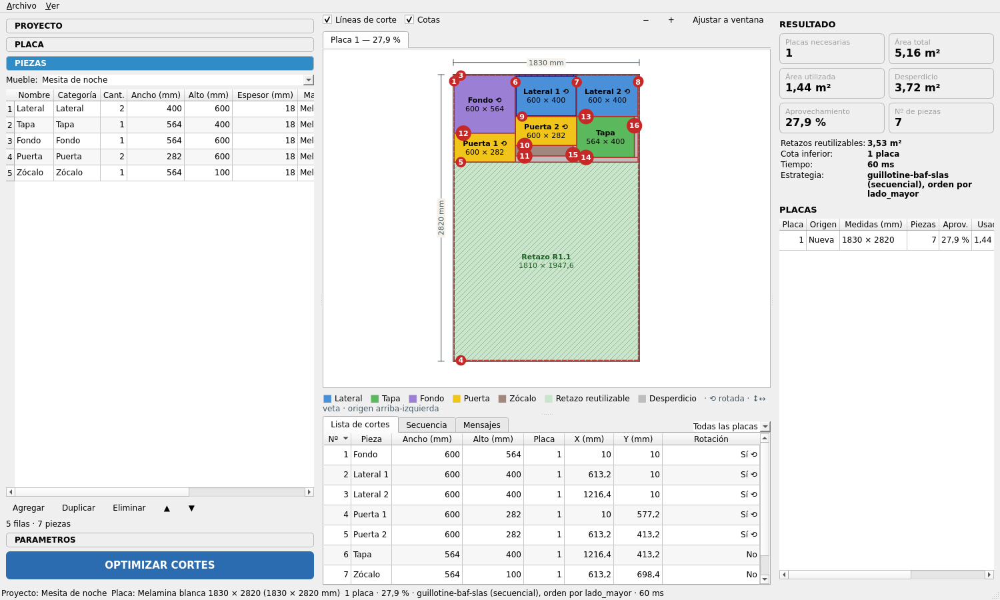

# Sprint 5 — Visualización y resultados

**Objetivo**: diagrama real a escala de cada placa, resumen de resultados, lista y secuencia de cortes, todo sincronizado.

**Requisitos cubiertos**: RF-06, RF-07, §9, §10, §11, §12, §13 (UI). Referencia: [05 §3–4](../05-interfaz-de-usuario.md#3-diagrama-de-placa-qgraphicsscene).

## Alcance

### 1. `ui/cutting_diagram_widget.py`
- [x] `SheetScene(QGraphicsScene)` construida **solo** desde `SheetLayout` (1 unidad de escena = 1 mm).
- [x] Ítems: placa, franja de margen, `PieceItem` (color por categoría, etiqueta "Lateral 1", "400 × 600", ⟲ si rotada, flecha de veta, tooltip con X/Y exactos), retazo reutilizable (rayado + etiqueta), desperdicio (gris).
- [x] Capa opcional de líneas de corte numeradas según `CutPlan`; capa opcional de cotas.
- [x] `SheetView(QGraphicsView)`: zoom con rueda, pan, "ajustar a ventana", antialiasing; texto legible en cualquier zoom.
- [x] Pestañas: una por placa con título "Placa n — xx,x %".
- [x] Leyenda generada desde `theme.CATEGORY_COLORS` (solo categorías presentes + retazo + desperdicio).

### 2. `ui/result_widget.py`
- [x] Tarjetas KPI: Placas necesarias, Área total, Área utilizada, Desperdicio, Aprovechamiento %, Nº de piezas, (cota inferior, tiempo, estrategia).
- [x] Tabla por placa: origen (nueva/inventario/retazo), piezas, % aprovechamiento, área usada, desperdicio, retazos.
- [x] Aviso destacado si hay piezas no ubicadas.

### 3. `ui/cut_list_widget.py`
- [x] Pestaña **Lista de cortes**: Nº, Pieza, Ancho, Alto, Placa, X, Y, Rotación (ordenable, filtrable por placa).
- [x] Pestaña **Secuencia**: CORTE n, nivel, orientación, medida de tope, longitud, piezas resultantes.
- [x] Sincronización bidireccional: seleccionar fila ⇄ resaltar pieza o corte en el diagrama (cambia de pestaña de placa si hace falta).

### 4. Persistencia del último resultado
- [x] Al abrir un proyecto se muestra su último `OptimizationResult` (si los datos no cambiaron; si cambiaron, banner "Resultado desactualizado").

## Tests del sprint
- `test_diagram.py`: el número de `PieceItem` = colocaciones; el `rect()` de cada ítem coincide con `Placement` (x, y, w, h) exactos.
- `test_result_widget.py`: los KPI coinciden con las métricas del resultado.
- Selección sincronizada (pytest-qt).

## Criterios de aceptación
- La demo muestra su(s) placa(s) con piezas a escala correcta, colores por categoría y leyenda.
- Ningún rectángulo del diagrama se dibuja sin un `Placement` u `Offcut` detrás.
- Las unidades elegidas se reflejan en todas las tablas y etiquetas.

## Resultado
**Estado: cerrado (2026-10-09).**

### Entregado
| Módulo | Contenido |
|--------|-----------|
| `ui/cutting_diagram_widget.py` | `SheetScene` construida solo desde `SheetLayout`: placa, franja de margen, `PieceItem`, `OffcutItem` (retazo rayado con etiqueta / desperdicio gris), `CutLineItem` (franja de kerf + número), `DimensionItem` (cotas de ancho y alto). `SheetView` con zoom bajo el cursor, pan, «Ajustar a ventana» y auto-ajuste mientras no se haga zoom. `CuttingDiagramWidget`: pestañas «Placa n — xx,x %», capas de cortes y cotas, leyenda desde `theme.CATEGORY_COLORS`, banner de resultado desactualizado |
| `ui/result_widget.py` | Tarjetas KPI (placas, área total, utilizada, desperdicio, aprovechamiento, nº de piezas) + cota inferior, tiempo, estrategia y retazos; tabla por placa (origen, medidas, piezas, %, usada, desperdicio, retazos); aviso rojo de piezas no ubicadas con el motivo. Clic en una placa → su pestaña |
| `ui/cut_list_widget.py` | Pestañas **Lista de cortes** y **Secuencia** (ordenables por valor numérico, filtro de placa en la esquina); la pestaña **Mensajes** (validación) se añade junto a ellas |
| `ui/main_window.py` | Panel central = diagrama + pestañas inferiores; sincronización bidireccional diagrama ⇄ tablas; `show_result` / `show_message`; banner «Resultado desactualizado» recalculado con la validación en vivo; tamaño del splitter central en `QSettings` |
| `services/optimization_service.py` | `input_fingerprint(project, plate)` (SHA-256 de placa, parámetros y despiece) guardada en el resultado por `finish`; `is_result_current(project, result)` |
| `models/resultado.py` | Campo `input_fingerprint` (en el JSON del resultado: sin migración de esquema) |

### Decisiones y desvíos respecto al plan
- **1 unidad de escena = 0,1 mm (unidad interna), no 1 mm.** Así los rectángulos coinciden exactamente con los enteros del modelo (ADR-002) y el test compara `rect()` con `Placement` sin tolerancias. La escala visual es la misma: solo cambia el factor del `QTransform`.
- **Textos a tamaño fijo de pantalla.** Etiquetas, números de corte y cotas se pintan sin transformación, centrados y recortados («…») al rectángulo que describen; si la pieza es demasiado chica en pantalla no se escribe nada. Legibles a cualquier zoom y nunca invaden otra pieza.
- **Veta**: ↕/↔ según la dirección **sobre la placa** (si la pieza está rotada, la flecha gira con ella). ⟲ marca la rotación.
- **Seleccionar un corte** en la Secuencia activa la capa «Líneas de corte» si estaba oculta. Seleccionar en una tabla filtrada por otra placa cambia el filtro.
- **Resultado desactualizado**: la huella cubre placa (medidas, espesor, veta, material), parámetros y el despiece generado; **no** el nombre del proyecto/muebles ni el stock disponible (cambiar el inventario no invalida un cálculo hecho). Se recalcula con la validación en vivo, así que el banner aparece también al editar, no solo al abrir. Resultados guardados sin huella se consideran desactualizados.
- **«Resultado» de la Secuencia** sigue en mm: son las etiquetas que genera `optimization/cutting.py` («Tira A (849,2 mm)»). Las columnas de medida de tope y longitud sí siguen la unidad elegida. Se revisará al estructurar esos datos para la exportación (sprint 6).
- Un mensaje (errores de validación, fallo, cancelación) **reemplaza** el resultado mostrado en los tres paneles, como en el sprint 4. Con errores de validación o piezas no ubicadas se pasa a la pestaña **Mensajes**.

### Verificación
- **310 tests pasan** (2 `xfail` del sprint 2). Nuevos: `test_diagram.py` (10), `test_result_widget.py` (6) y 4 en `test_ui_smoke.py`. Cubren:
  - nº de `PieceItem` = colocaciones y `rect()` idéntico a cada `Placement`; cada ítem de la escena es la placa, el margen, una colocación, un `Offcut`, un corte o una cota (regla de oro);
  - las líneas de corte reproducen la franja de kerf de cada `Cut`; marcas ⟲ y de veta; leyenda solo con las categorías presentes;
  - etiquetas, tooltips, columnas y encabezados cambian con la unidad (mm → cm);
  - KPI = métricas del resultado; tabla por placa; aviso de piezas no ubicadas;
  - filtro por placa y orden numérico; selección diagrama ⇄ lista y secuencia → corte resaltado (pytest-qt);
  - reabrir el proyecto muestra su último resultado; editar una medida o el kerf → banner; deshacer la edición lo quita; renombrar no.
- Cobertura de `ui/`: 90 % (`result_widget` 100 %, `cut_list_widget` 96 %, `cutting_diagram_widget` 89 %; lo no cubierto es sobre todo pintura con zoom extremo).
