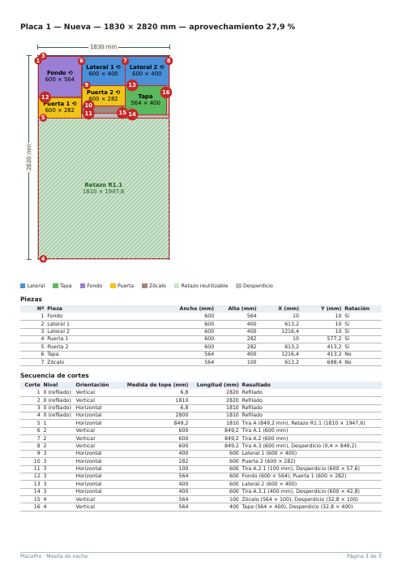
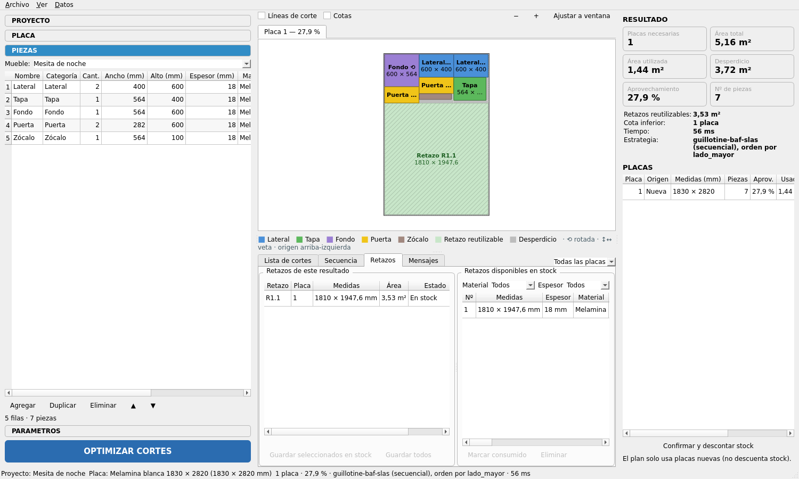

# Sprint 6 — Exportación, inventario y retazos

**Objetivo**: llevar el resultado al taller (PDF/CSV) y gestionar stock de placas y retazos reutilizables.

**Requisitos cubiertos**: RF-08 (UI), RF-09, RF-10, §14, §15, §22.

## Alcance

### 1. Exportadores (`exporters/`)
- [x] `base.py`: `Protocol Exporter { id, name, file_filter, export(project, result, path, options) }` + registry `EXPORTERS` (menú Exportar generado dinámicamente).
- [x] `pdf_exporter.py` (`QPdfWriter` + `QPainter`, A4):
  - **Página 1**: información del proyecto (nombre, fecha, muebles, placa, parámetros de corte).
  - **Página 2**: resumen de materiales (placas por formato, áreas, aprovechamiento, retazos, lista de piezas agregada).
  - **Página 3..n**: una placa por página: diagrama a escala (mismo renderizado que la UI, reutilizando `SheetScene.render()`), tabla de piezas con X/Y/rotación, secuencia de cortes.
  - Pie con número de página y nombre del proyecto.
- [x] `csv_exporter.py`: `piezas.csv` (lista de piezas del proyecto) y `cortes.csv` (Nº, Pieza, Ancho, Alto, Placa, X, Y, Rotación + secuencia), separador `;`, UTF-8 con BOM (compatible con Excel en español).
- [x] `services/report_service.py`: orquesta exportadores y nombres de archivo por defecto.

### 2. Inventario (`ui/inventory_widget.py`)
- [x] Diálogo: formatos con cantidad disponible editable.
- [x] Opción "Utilizar primero las placas existentes" ya conectada al optimizador (sprint 2) — verificar en UI.
- [x] Al **confirmar** un plan de corte (botón "Confirmar y descontar stock"): descontar placas de inventario usadas y marcar retazos consumidos (transacción).

### 3. Retazos (`ui/offcuts_widget.py`)
- [x] Tabla de retazos del resultado actual (dimensiones, placa, estado) con "Guardar en stock".
- [x] Sección **Retazos disponibles**: filtro por material/espesor, eliminar, marcar consumido.
- [x] Opción "Usar retazos primero" en parámetros.

## Tests del sprint
- `test_exporters.py`: el PDF existe, tiene `2 + nº_placas` páginas (comprobado con `pypdf` como dependencia de test o contando `/Type /Page`); el CSV tiene una fila por pieza colocada y los valores coinciden con el resultado.
- `test_inventory.py`: confirmar plan descuenta stock; no se permite stock negativo.
- `test_offcuts_flow.py`: guardar retazo → aparece disponible → una optimización lo usa → queda consumido.

## Criterios de aceptación
- Exportar la demo genera un PDF legible de ≥ 3 páginas y dos CSV que abren correctamente en LibreOffice/Excel.
- Añadir un nuevo exportador solo requiere un archivo nuevo + registro (demostrar con un `SvgExporter` mínimo opcional).

## Resultado
**Estado: cerrado (2026-10-09).**

### Entregado
| Módulo | Contenido |
|--------|-----------|
| `exporters/base.py` | `Exporter` (Protocol: `id`, `name`, `file_filter`, `suffix`, `menu_order`, `export(context, path) -> list[Path]`), `ExportContext`, `register`, `EXPORTERS` |
| `exporters/__init__.py` | `load_exporters()`: importa los formatos de `FORMAT_MODULES` bajo demanda |
| `exporters/tables.py` | Lista de cortes, secuencia, despiece y resumen por placa: mismas columnas en PDF y CSV |
| `exporters/pdf_exporter.py` | A4 a 96 ppp: proyecto · resumen de materiales · una página por placa (diagrama con cortes y cotas, leyenda, piezas, secuencia). Pie «PlacaPro · proyecto» y «Página i de N». Paginador propio: las tablas largas continúan con «(cont.)» |
| `exporters/csv_exporter.py` | `<nombre>_piezas.csv` y `<nombre>_cortes.csv` (lista de cortes + fila vacía + «Secuencia de cortes»), `;`, coma decimal, UTF-8 con BOM |
| `exporters/svg_exporter.py` | Exportador mínimo de demostración: un SVG por placa |
| `services/report_service.py` | `build_context` (despiece generado, materiales, placa), `default_filename`, `export`; `safe_filename` |
| `services/inventory_service.py` | `confirm_result(result_id)`: descuenta placas y consume retazos en **una transacción**; `ConfirmationError` |
| `models/resultado.py` | `confirmed_at`, `stock_plates_used()`, `stock_offcuts_used()` |
| `models/plan_corte.py` | `ReleasedPart` / `PartKind` y `Cut.parts`: lo que libera cada corte, estructurado; `Cut.resulting_labels(unit)` |
| `ui/inventory_widget.py` | Diálogo Datos ▸ Inventario de placas: cantidad por formato (spinbox ≥ 0); guarda solo los cambios |
| `ui/offcuts_widget.py` | Pestaña **Retazos**: retazos del resultado (Guardar seleccionados / todos en stock) y stock disponible (filtro por material y espesor, Marcar consumido, Eliminar) |
| `ui/main_window.py` | Archivo ▸ Exportar ▸ (generado desde el registro), menú Datos, botón **Confirmar y descontar stock** con resumen de lo que se descuenta |

### Decisiones y desvíos respecto al plan
- **Firma del exportador**: `export(context, path)` en lugar de `export(project, result, path, options)`. `ExportContext` reúne proyecto, resultado, placa, despiece generado, nombres de material, unidad y fecha. Así los exportadores no tocan la base.
- **Carga diferida de formatos.** PDF y SVG usan Qt y `test_core_layers_do_not_import_qt` exige que `services/` no lo importe. Por eso importar `exporters` no registra nada y `ReportService` llama a `load_exporters()`. Para añadir un formato: un módulo con `register(...)` y su nombre en `FORMAT_MODULES` (el test registra un exportador de texto en el momento).
- **Páginas del PDF**: `2 + nº de placas` mientras las tablas quepan. Si una placa tiene muchas piezas o cortes, sus tablas continúan en páginas adicionales en lugar de recortarse.
- **PDF a 96 ppp**: el diagrama reutiliza `SheetScene.render()` y sus textos de tamaño fijo de pantalla salen a ≈ 8 pt. El documento es vectorial igual. El rayado del retazo pasó a dibujarse con líneas explícitas: los patrones de `QBrush` dependen de la resolución y salían casi negros en el PDF.
- **Unidades**: el PDF y los CSV usan la unidad elegida en Ver ▸ Unidades. Se resolvió la deuda del sprint 5: la columna «Resultado» de la secuencia ahora sigue la unidad (datos estructurados en `Cut.parts`; `resulting` en mm se mantiene para los resultados viejos).
- **Confirmar un plan** solo se permite con el resultado guardado, sin confirmar y vigente (no desactualizado). Se hace una sola vez (`confirmed_at` en el JSON del resultado, sin migración). Si no alcanza el stock o un retazo ya se consumió o eliminó, no se descuenta nada y se pide volver a optimizar. Un plan que solo usa placas nuevas también se puede confirmar (queda registrado, sin descontar).
- **Retazos consumidos al confirmar**, no al optimizar (decisión del sprint 3): optimizar varias veces no gasta el stock.
- Las opciones «Usar primero placas del inventario» y «Usar retazos del stock» ya estaban en PARÁMETROS (sprint 4); se verificaron de punta a punta en `test_offcuts_flow.py` y en la UI.

### Verificación
- **329 tests pasan** (2 `xfail` del sprint 2). Nuevos: `test_exporters.py` (9), `test_inventory.py` (4), `test_offcuts_flow.py` (1) y 5 en `test_ui_smoke.py`. Cubren:
  - el PDF existe y tiene `2 + nº de placas` páginas (contando `/Type /Page`, sin `pypdf`); la demo da 3; las tablas largas se reparten sin perder ni repetir filas;
  - CSV: BOM, `;`, una fila por pieza colocada con valores idénticos al resultado, secuencia completa, unidad del contexto;
  - SVG: un archivo por placa; registro de un exportador nuevo en el momento;
  - confirmar descuenta una sola vez, nunca deja stock negativo y es atómico (retazo no disponible ⇒ ni las placas se descuentan);
  - retazo: guardar → disponible → otra optimización lo usa → confirmar → `CONSUMED` y fuera del stock;
  - UI: menú Exportar, exportar en cm, confirmar (y bloqueado si está desactualizado o sin guardar), pestaña Retazos (guardar, consumir, eliminar), diálogo de inventario (guardar / cancelar).
- Cobertura: `exporters/` 98 %, `services/` 94 %+, `ui/inventory_widget` 100 %, `ui/offcuts_widget` 92 %.
- Exportar la demo genera un PDF de 3 páginas y dos CSV (revisados visualmente: ver capturas).
