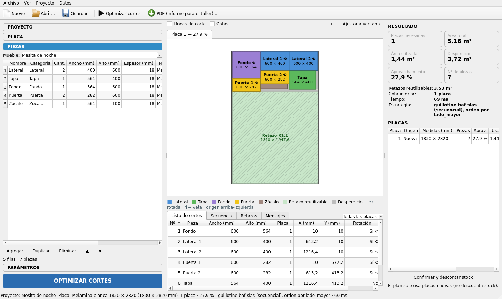

# Sprint 7 — Validación, pulido y entrega

**Objetivo**: robustez, experiencia de usuario, demo automática, prueba completa y documentación final.

**Requisitos cubiertos**: RF-12, RF-13, §19, §24, §28, §31 (pasos 11–14), §33, §35.

## Alcance

### 1. Validaciones completas (RF-12)
- [x] Revisión de todos los códigos: `PIECE_LARGER_THAN_PLATE`, `NON_POSITIVE_DIMENSION`, `ZERO_QUANTITY`, `THICKNESS_MISMATCH`, `INVALID_KERF`, `MARGIN_TOO_LARGE`, `UNPLACEABLE_PIECE`, `MATERIAL_MISMATCH`.
- [x] Mensajes en español, accionables ("La pieza «Puerta» (482 × 2900) no cabe en la placa 1830 × 2820 con la veta vertical; reduzca el alto o cambie la veta").
- [x] Validación en línea en la tabla + bloqueo del botón optimizar con errores bloqueantes (advertencias no bloquean).

### 2. Demo "Mesita de noche" (RF-13)
- [x] Al primer arranque (DB nueva) se abre la demo y se optimiza automáticamente.
- [x] Piezas: 2 × 400×600 (Lateral), 1 × 564×400 (Tapa), 1 × 564×600 (Fondo), 2 × 282×600 (Puerta), 1 × 564×100 (Zócalo/Divisor) sobre placa 1830×2820×18, kerf 3.2, margen 10.

### 3. Prueba E2E
- [x] `test_demo_mesita.py`: seed → optimizar → verificar invariantes → plan de corte reconstruye piezas → exportar PDF y CSV a `tmp_path`.
- [ ] Prueba manual guiada (checklist en este documento) de los 9 pasos del flujo de usuario. *(pendiente de recorrer con la interfaz; automatizada sin UI en `test_mueble_bajo_manual_checklist`)*
- [x] Ejecutar la suite completa + benchmarks; actualizar `docs/benchmarks.md`.

### 4. Pulido
- [x] Tema visual final (QSS), iconos, atajos (Ctrl+N/O/S/Shift+S, Ctrl+Enter = optimizar, Ctrl+E = exportar).
- [x] Tooltips explicativos de kerf, margen y veta en el panel de parámetros.
- [x] Revisar rendimiento con 200 piezas (UI fluida, cancelación inmediata).
- [x] Revisar textos y ortografía.

### 5. Preparación para el futuro (sin UI)
- [x] `FurnitureGenerator`: ejemplo `DeskGenerator` mínimo documentado en código (marcado experimental, no expuesto en la UI) que demuestra el pipeline Dimensiones → Despiece → Piezas → Optimizador.
- [x] `CostService` con entidades y tablas listas; test que verifica la firma.

### 6. README.md (raíz) — §33
- [x] Instalación (Python 3.11+, venv, dependencias de sistema Qt en Linux), dependencias, cómo ejecutar.
- [x] Cómo crear una placa, un proyecto, agregar piezas, ejecutar la optimización.
- [x] Cómo interpretar el resultado (definiciones de área, aprovechamiento, retazo vs desperdicio).
- [x] Cómo modificar kerf y margen (con el ejemplo numérico de 513,2).
- [x] Cómo trabajar con veta (tabla de orientaciones).
- [x] Cómo exportar (PDF/CSV).
- [x] Explicación técnica del algoritmo (resumen de [03](../03-algoritmo-de-optimizacion.md) + por qué el score es lexicográfico).
- [x] Separación optimización matemática / plan de corte físico.
- [x] Cómo ejecutar los tests.

## Checklist de prueba manual
1. [ ] Crear proyecto "Mueble bajo".
2. [ ] Seleccionar placa 1830 × 2820 × 18.
3. [ ] Introducir las 5 piezas del ejemplo del enunciado (laterales 700×500, tapa/base 964×500, fondo 964×664, puertas 482×700).
4. [ ] Kerf 3,2; margen 10; equilibrada.
5. [ ] OPTIMIZAR.
6. [ ] Placas visibles, a escala, con leyenda.
7. [ ] Desperdicio y retazos coherentes.
8. [ ] Lista de cortes con X/Y verificables a mano para 2 piezas.
9. [ ] Exportar PDF y CSV.

## Criterios de aceptación (entrega final)
- `python app.py` → aplicación funcional con la demo optimizada.
- `pytest` en verde, cobertura objetivo alcanzada.
- README completo; documentos de `docs/` actualizados con la sección *Resultado* de cada sprint.

## Resultado
**Estado: cerrado (2026-10-09)**, salvo el recorrido manual de la checklist, que queda para hacer con la interfaz.

### Entregado
| Módulo | Contenido |
|--------|-----------|
| `models/validation.py` | `PIECE_LARGER_THAN_PLATE` accionable. Ejemplo: «La pieza «Puerta» (482 × 2900 mm) no cabe en la placa 1830 × 2820 con la veta vertical (superficie útil 1810 × 2800 mm con margen de 10 mm); reduzca el alto». Dice qué medida sobra y, si cabría girada, qué impide girarla: veta → «cambie la veta a «Indiferente»», orientación fija, «no girar», o la rotación desactivada en PARÁMETROS |
| `ui/main_window.py` | Botón **OPTIMIZAR CORTES** y acción *Optimizar* deshabilitados con errores bloqueantes (tooltip explicativo); las advertencias no bloquean. Menú **Proyecto** (Optimizar, Cancelar, Confirmar y descontar stock). Barra de herramientas con iconos (Nuevo, Abrir, Guardar, Optimizar, PDF). Atajos `Ctrl+Enter`/`Ctrl+Return`/`F5` (optimizar) y `Ctrl+E` (PDF) |
| `app.py` | En el primer arranque (base nueva) la demo «Mesita de noche» se abre y **se optimiza sola**; en los siguientes se muestra el último resultado guardado. `sys.setswitchinterval(GIL_SWITCH_INTERVAL_S)` |
| `ui/workers.py` | Avisos de progreso limitados a uno cada 50 ms; `GIL_SWITCH_INTERVAL_S = 0.0005` |
| `ui/tooltips.py` | Ayuda de kerf (con el ejemplo 513,2), margen, separación, rotación, nivel, máquina, mínimos de retazo, veta de placa y de pieza (cabecera de la columna *Veta*). `LengthEdit.set_help()` combina la ayuda con la unidad y con el error |
| `ui/theme.py` | El relleno vertical de las pestañas del panel izquierdo recortaba la tilde de «PARÁMETROS» |
| `services/furniture_generator.py` | `DeskGenerator` **experimental**, no registrado ni visible en la UI: tapa, 2 laterales y faldón a partir de `FurnitureDimensions` |
| `scripts/benchmark.py` | `--write` conserva las secciones escritas a mano de `docs/benchmarks.md` |
| `README.md` (raíz) | Instalación (incluidas las bibliotecas de Qt en Linux), uso paso a paso, interpretación del resultado, kerf y margen con el ejemplo 513,2, tabla de veta, exportación, algoritmo y puntuación lexicográfica, optimización frente a plan físico, tests, atajos |

### Decisiones y desvíos respecto al plan
- **Contención del GIL.** Con 200 piezas la ventana quedaba congelada ≈ 2 s mientras optimizaba, aunque el cálculo corre en un hilo aparte. La causa es que cada llamada de Qt a Python (pintar la tabla de piezas, `data()` de los modelos) esperaba hasta 5 ms, el intervalo por defecto del GIL, a que el optimizador lo soltara. Bajarlo a 0,5 ms deja pausas menores a 50 ms durante el cálculo y no cambia el tiempo del optimizador de forma medible (2,10 s → 2,14 s). Se descartó `multiprocessing`: obliga a serializar la petición y el resultado, y complica la cancelación. Medidas en [benchmarks.md](../benchmarks.md#interfaz-con-200-piezas-sprint-7).
- **Cancelación**: el optimizador ya revisaba el token en cada intento, y se detiene en 5–10 ms.
- **Demo automática solo con base nueva.** Si el usuario modifica o borra la demo, no se vuelve a crear ni a optimizar. `create_main_window(optimize_demo=False)` lo desactiva en los tests que necesitan una ventana sin cálculo en curso.
- **`Ctrl+E` exporta en el primer formato del menú (PDF)** sin abrir un submenú. Los demás formatos siguen en Archivo ▸ Exportar.
- **`DeskGenerator` sin registrar.** `validate_project` valida las piezas cargadas a mano (`furniture.pieces`), no el despiece generado. Exponer generadores requiere validar ese despiece y mapear los mensajes al mueble, y quedó anotado en [08-roadmap-futuro.md](../08-roadmap-futuro.md).
- **`CostService`**: la firma `compute(project, result, material_costs=None) -> CostBreakdown` está fijada por un test; sigue lanzando `NotImplementedError`. Las entidades (`models/costos.py`) y las tablas `hardware_items` / `furniture_hardware` existían desde el sprint 1.
- El código `MARGIN_TOO_LARGE` y los demás ya existían desde el sprint 1. Los mensajes se revisaron; solo el de «no cabe» necesitaba indicar qué hacer.

### Verificación
- **351 tests pasan** (2 `xfail` del sprint 2), en 54 s. Nuevos:
  - `test_demo_mesita.py` (2): punta a punta de la demo y del «Mueble bajo» de la checklist (detallado abajo);
  - `test_future_ready.py` (9): `DeskGenerator` y el pipeline hasta el optimizador con veta; firma de `CostService` y tablas de costos;
  - 5 en `test_validation.py`: mensajes accionables;
  - 1 en `test_app.py`: la demo se optimiza en el primer arranque y se reutiliza en el segundo;
  - 5 en `test_ui_smoke.py`: bloqueo del botón con errores y no con advertencias, atajos y barra, acción Optimizar/Cancelar, tooltips, progreso limitado.
- `test_demo_mesita.py` recorre:
  - los datos iniciales, comprobando las piezas, la placa, el kerf y el margen de RF-13;
  - optimizar y verificar los invariantes;
  - reconstruir las piezas y sobrantes con el plan de corte;
  - exportar PDF (3 páginas) y CSV;
  - el ejemplo «Mueble bajo», también en 1 placa, con X/Y de la primera pieza en el margen (10, 10) y su vecina a ≥ 1 kerf.
- Cobertura total **96 %**: `optimization/` 96–100 %, `utils/` 93–100 %, `services/` 94–100 %, `database/` 91–100 %. Supera los objetivos de [06](../06-estrategia-de-testing.md).
- `ruff check` y `ruff format --check` limpios.
- Benchmarks regenerados (`python scripts/benchmark.py --write`), con todos los resultados verificados. 200 piezas: 16 placas en 0,14 s (Rápida), 1,9 s (Equilibrada) y 25 s (Máxima).
- Captura de la ventana con la demo optimizada en el primer arranque (arriba) y del README.

